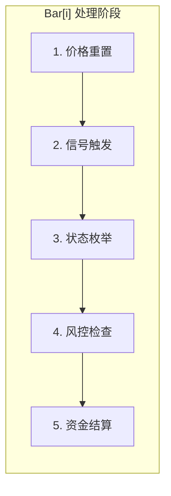
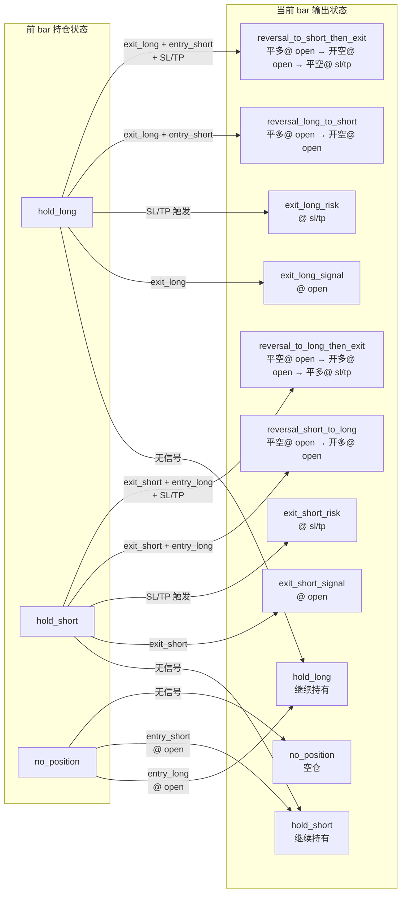

# 回测引擎架构文档

本文档描述回测引擎的核心工作流程，重点阐释**状态机**的运行逻辑。

---

## 1. 系统概览

**核心特性**：
- **单仓位全仓模式**：同一时刻仅持有一个方向（多/空），无杠杆，每次开仓使用全部可用资金。
- **价格驱动状态**：通过四个价格字段组合推断持仓状态，而非显式枚举。
- **双模式风控**：`next_bar`（下根 K 线开盘离场）与 `in_bar`（当根 K 线内触价离场）。

**技术栈**：Rust + PyO3 + Polars

---

## 2. 状态机核心流程

回测引擎的每一根 K 线 (`bar[i]`) 都遵循以下状态机流程：



### 2.1 信号清洗（预处理阶段）

> **时机**：主循环开始前，使用 Polars Lazy API 批量处理。
> **目的**：确保信号不会导致状态枚举产生歧义。

#### 清洗规则

| 规则 | 条件 | 处理 |
|-----|------|------|
| **R1** | `entry_long && entry_short` | **两者都设为 false** |
| **R2** | `entry_long && exit_long` | `entry_long = false` |
| **R3** | `entry_short && exit_short` | `entry_short = false` |
| **R4** | `skip_mask = true` | 进场信号全部屏蔽 |
| **R5** | `atr = NaN`（启用 ATR 风控时） | 进场信号全部屏蔽 |

#### 约束关系：信号清洗 → 状态枚举

状态枚举依赖于清洗后的信号满足以下**互斥约束**：

```
约束1: ¬(entry_long ∧ entry_short)   // 不能同时进多进空
约束2: ¬(entry_long ∧ exit_long)     // 不能同 bar 进多又平多
约束3: ¬(entry_short ∧ exit_short)   // 不能同 bar 进空又平空
```

若违反约束：
- 违反约束1 → `hold_long + hold_short` 同时存在，语义矛盾
- 违反约束2/3 → 进场即离场，交易无意义

**输出**：`PreparedData` 结构体，含清洗后的信号切片和 OHLCV 数据。

---

### 2.2 价格重置（阶段 1）

> **时机**：每根 K 线处理开始时。

若上一 Bar 完成了离场（`exit_price.is_some()`），则本 Bar 需要：
- 重置对应方向的 `entry_price` 和 `exit_price` 为 `None`
- 调用 `risk_state.reset_[long|short]_state()` 清空风控价格

这确保了离场后能够正确进入新仓位。

---

### 2.3 信号触发（阶段 2）

> **时机**：价格重置后，基于 `bar[i-1]` 信号处理。

#### 运行时逻辑约束

| 约束 | 说明 |
|------|------|
| 进场需无仓位或正在反手 | `can_entry_long() = has_no_position() \|\| is_exiting_short()` |
| 离场需持有对应仓位 | `has_long_position()` 时才处理 `exit_long` 信号 |
| 持仓时忽略同向进场信号 | 持多头时 `entry_long` 信号被忽略 |
| 无仓时忽略离场信号 | 无持仓时 `exit_long/short` 信号被忽略 |

#### 离场逻辑（策略信号）
```
if has_long_position() && prev_bar.exit_long:
    exit_long_price = current_bar.open  # Next Bar 模式
```

#### 进场逻辑（含跳空检查）

进场时会先执行跳空保护检查，通过后才设置进场价格。

```
if can_entry_long() && prev_bar.entry_long:
    is_safe = check_entry_safety(params, Direction::Long)  # 跳空保护
    if is_safe:
        entry_long_price = current_bar.open
        first_entry_side = 1
```

**跳空保护检查范围**：
- SL PCT/ATR：`open_price < sl_price` (多头) 或 `open_price > sl_price` (空头)
- TP PCT/ATR：`open_price > tp_price` (多头) 或 `open_price < tp_price` (空头)
- TSL PCT/ATR：`open_price < tsl_price` (多头) 或 `open_price > tsl_price` (空头)
- TSL PSAR：`open_price < psar_price` (多头) 或 `open_price > psar_price` (空头)

如果任一条件满足，则跳过进场。

---

### 2.4 单 Bar 状态枚举（阶段 3）

基于**六个字段**的组合（四个价格 + `in_bar_direction` + `first_entry_side`）可推断出以下 15 种合法状态：

| # | entry_L | exit_L | entry_S | exit_S | in_bar | first_entry | 状态 |
|:-:|:-------:|:------:|:-------:|:------:|:------:|:-----------:|------|
| 1 | ✗ | ✗ | ✗ | ✗ | 0 | 0 | `no_position` |
| 2 | ✓ | ✗ | ✗ | ✗ | 0 | 0 | `hold_long` (延续) |
| 3 | ✓ | ✗ | ✗ | ✗ | 0 | 1 | `hold_long_first` (进场) |
| 4 | ✗ | ✗ | ✓ | ✗ | 0 | 0 | `hold_short` (延续) |
| 5 | ✗ | ✗ | ✓ | ✗ | 0 | -1 | `hold_short_first` (进场) |
| 6 | ✓ | ✓ | ✗ | ✗ | 0 | 0 | `exit_long_signal` |
| 7 | ✓ | ✓ | ✗ | ✗ | 1 | 0 | `exit_long_risk` (持仓后) |
| 8 | ✓ | ✓ | ✗ | ✗ | 1 | 1 | `exit_long_risk_first` (秒杀) |
| 9 | ✗ | ✗ | ✓ | ✓ | 0 | 0 | `exit_short_signal` |
| 10| ✗ | ✗ | ✓ | ✓ | -1 | 0 | `exit_short_risk` (持仓后) |
| 11| ✗ | ✗ | ✓ | ✓ | -1 | -1 | `exit_short_risk_first` (秒杀) |
| 12| ✓ | ✓ | ✓ | ✗ | 0 | -1 | `reversal_L_to_S` |
| 13| ✓ | ✗ | ✓ | ✓ | 0 | 1 | `reversal_S_to_L` |
| 14| ✓ | ✓ | ✓ | ✓ | 1 | 1 | `reversal_to_L_risk` |
| 15| ✓ | ✓ | ✓ | ✓ | -1 | -1 | `reversal_to_S_risk` |

> **状态说明**：
> - `first_entry_side`：标记进场方向。`0`=非进场 bar，`1`=多头首次进场，`-1`=空头首次进场
> - `in_bar_direction`：标记离场模式。`0`=无/Next-Bar 离场，`1`=多头 In-Bar 离场，`-1`=空头 In-Bar 离场
> - "秒杀" 状态：同 bar 内进场后立即被风控平仓（`first_entry_side` 和 `in_bar_direction` 同时非零）

**辅助函数**（定义于 `BacktestState`）：
- `has_long_position()`: `entry_long.is_some() && exit_long.is_none()`
- `is_exiting_long()`: `entry_long.is_some() && exit_long.is_some()`
- `can_entry_long()`: `has_no_position() || is_exiting_short()`

### 2.4.1 状态转换图（时序视角）

> 信号在 `bar[i-1]` 触发，执行在 `bar[i]` 完成。

#### 状态转换路径



#### 时序示例表

| bar | 前 bar 信号 | 当前执行 | 最终状态 |
|:---:|-------------|----------|----------|
| i | `entry_long=true` | `entry_long_price=open` | `hold_long` |
| i+1 | `exit_long=true` | `exit_long_price=open` | `exit_long_signal` |
| i+2 | 无 | 价格重置 | `no_position` |

| bar | 前 bar 信号 | 当前执行 | 最终状态 |
|:---:|-------------|----------|----------|
| i | `entry_long=true` | `entry_long_price=open` | `hold_long` |
| i+1 | 无信号，但触发 SL | `exit_long_price=sl_price` | `exit_long_risk` |
| i+2 | 无 | 价格重置 | `no_position` |

| bar | 前 bar 信号 | 当前执行 | 最终状态 |
|:---:|-------------|----------|----------|
| i | `entry_short=true` | `entry_short_price=open` | `hold_short` |
| i+1 | `exit_short + entry_long` | 平空(open) + 开多(open) | `reversal_short_to_long` |
| i+2 | 无 | 继续持有多头 | `hold_long` |

| bar | 前 bar 信号 | 当前执行 | 最终状态 |
|:---:|-------------|----------|----------|
| i | `entry_short=true` | `entry_short_price=open` | `hold_short` |
| i+1 | `exit_short + entry_long` + 触发 SL | 平空(open) + 开多(open) + 风控平多(sl) | `reversal_to_long_then_exit` |
| i+2 | 无 | 价格重置 | `no_position` |

### 2.5 风控检查与 In-Bar / Next-Bar 处理（阶段 4）

> **时机**：信号触发后，基于 `bar[i]` 价格进行检查。

#### 风控类型与离场模式

| 类型 | 受 `sl_exit_in_bar` / `tp_exit_in_bar` 影响 | 可能的离场模式 |
|---------|:-------------------:|--------------|
| **策略信号** (entry_long, exit_long, entry_short, exit_short) | ❌ 否 | 仅 Next-Bar |
| **SL/TP** (sl_pct, sl_atr, tp_pct, tp_atr) | ✅ 是 | In-Bar 或 Next-Bar |
| **TSL** (tsl_pct, tsl_atr) | ❌ 否 | 仅 Next-Bar |
| **PSAR** (tsl_psar) | ❌ 否 | 仅 Next-Bar |

> [!IMPORTANT]
> `sl_exit_in_bar` / `tp_exit_in_bar` 参数**只影响 SL/TP**。策略信号、TSL 和 PSAR 始终使用 Next-Bar 模式。

#### 触发模式 (Trigger Mode)

控制用什么价格检测止损止盈是否**触发**。

| 参数 | 说明 |
|------|------|
| `sl_trigger_mode` | SL 触发检测。`False`=close, `True`=high/low |
| `tp_trigger_mode` | TP 触发检测。`False`=close, `True`=high/low |
| `tsl_trigger_mode` | TSL 触发检测(含psar)。`False`=close, `True`=high/low |

#### 锚点模式 (Anchor Mode)

控制用什么价格作为计算 SL/TP/TSL **价格阈值**的锚点。

| 参数 | 说明 |
|------|------|
| `sl_anchor_mode` | SL 锚点。`False`=close, `True`=high/low |
| `tp_anchor_mode` | TP 锚点。`False`=close, `True`=high/low |
| `tsl_anchor_mode` | TSL 锚点。`False`=close, `True`=high/low |

> [!NOTE]
> 多头：SL 用 low，TP/TSL 用 high 作为锚点。
> 空头：SL 用 high，TP/TSL 用 low 作为锚点。

#### In-Bar vs Next-Bar

| 模式 | 适用风控 | 离场价格 | 状态标记 |
|-----|---------|---------|---------|
| **In-Bar** | SL/TP（当 `sl_exit_in_bar`/`tp_exit_in_bar`=true） | 触发价（SL/TP 价格） | `in_bar_direction = 1/-1` |
| **Next-Bar** | TSL/PSAR，或 SL/TP（当 ...=false） | `next_bar.open` | `in_bar_direction = 0` |

#### `in_bar_direction` 字段
- **类型**: `i8`
- **含义**: `0` = Next-Bar 离场, `1` = 多头 In-Bar 离场, `-1` = 空头 In-Bar 离场

> 详细的风控规则请参考 [risk_management.md](./risk_management.md)。

---

### 2.6 资金结算（阶段 5）

> **时机**：风控检查完成后。

#### 结算逻辑

**已实现盈亏计算（离场时）：**
```
# 1. 原始交易计算（百分比盈亏模式）
pnl_raw_pct = (exit_price - entry_price) / entry_price  # 多头
pnl_raw_pct = (entry_price - exit_price) / entry_price  # 空头
realized_value = balance * (1 + pnl_raw_pct)

# 2. 费用计算（开平各收一半）
fee = fee_fixed
    + balance * fee_pct / 2           # 开仓费用
    + realized_value * fee_pct / 2    # 平仓费用

# 3. 净值结算
new_balance = realized_value - fee
```

**未实现盈亏计算（持仓时）：**
```
unrealized_pnl_pct = (current_close - entry_price) / entry_price  # 多头
unrealized_pnl_pct = (entry_price - current_close) / entry_price  # 空头
equity = balance * (1 + unrealized_pnl_pct)
```

**综合回报率（反手场景）：**
```
# 当同 bar 发生多次结算时（如反手），综合计算整个 bar 的总回报率
if balance != bar_start_balance:
    trade_pnl_pct = balance / bar_start_balance - 1
```

#### 核心字段
- `balance`: 已实现盈亏（离场时更新）
- `equity`: 含未实现盈亏（每 Bar 更新）
- `peak_equity`: 历史最高净值（用于回撤计算）

#### 余额归零保护

引擎实现了资金保护机制，防止产生负余额或负净值：

```
# 余额和净值归零保护
if balance < 0:
    balance = 0
if equity < 0:
    equity = 0

# 归零后跳过后续处理
def should_skip_current_bar():
    return balance <= 0 or equity <= 0
```

> [!WARNING]
> 当 `balance` 或 `equity` 归零后，该 Bar 及后续所有 Bar 将跳过仓位和资金计算。

---

## 3. 输入/输出规格

### 输入
| 名称 | 类型 | 说明 |
|------|------|------|
| OHLCV 数据 | `DataFrame` | time, open, high, low, close, volume |
| 策略信号 | `i32[]` | entry_long, exit_long, entry_short, exit_short |
| 回测参数 | `BacktestParams` | 资金、手续费、风控配置 |

### 输出列

#### 核心价格列
- `entry_long_price`, `entry_short_price`: 多空进场价
- `exit_long_price`, `exit_short_price`: 多空离场价（含策略信号与风控触发）

#### 资金状态列
- `balance`, `equity`
- `current_drawdown`: 当前回撤比例 (0~1范围，用于绩效分析)
- `trade_pnl_pct`, `total_return_pct`
- `fee`, `fee_cum`

#### 风控状态列
- `risk_in_bar_direction` (Int8): 风控触发方向（0=无, 1=多头In-Bar, -1=空头In-Bar）

> [!TIP]
> **风控离场推断**：
> 用户可通过 `exit_long_price` 且 `risk_in_bar_direction`即可识别风控离场点。

#### 可选风控价格列
- `sl_pct_price_long/short`, `tp_pct_price_long/short`, `tsl_pct_price_long/short`
- `sl_atr_price_long/short`, `tp_atr_price_long/short`, `tsl_atr_price_long/short`

---

## 4. 关键设计决策

1. **价格驱动 vs 枚举驱动**：选择价格驱动，使输出 DataFrame 即为完整状态记录，利于调试。
2. **首次进场标记**：`first_entry_side` (i8) 用于正确初始化风控价格阈值。`0`=非进场，`1`=多头，`-1`=空头。
3. **方向分离的风控**：SL/TP/TSL 价格按多空分别存储，支持多空同时持有的未来扩展。
4. **`in_bar_direction` 设计**：使用 `i8` 代替 `bool`，明确区分离场方向。`0`=Next-Bar，`1`=多头 In-Bar，`-1`=空头 In-Bar。

---

## 5. 代码结构

```
src/backtest_engine/backtester/
├── main_loop.rs              # 主循环入口
├── mod.rs                    # 模块导出与公开接口
├── data_preparer.rs          # 数据准备 (PreparedData 结构体)
├── signal_preprocessor.rs    # 信号预处理（R1-R5 冲突解决、屏蔽规则）
├── atr_calculator.rs         # ATR 指标计算
├── buffer_slices.rs          # 缓冲区切片工具
├── output/                   # 输出缓冲区模块
│   ├── mod.rs                    # 模块导出
│   ├── output_struct.rs          # OutputBuffers 结构体定义（固定列与可选列）
│   ├── output_init.rs            # 缓冲区初始化逻辑
│   ├── output_convert.rs         # 转换为 DataFrame
│   └── output_validate.rs        # 数组长度验证
└── state/
    ├── mod.rs                    # 模块导出
    ├── backtest_state.rs         # BacktestState 核心状态机
    │                             # - 状态判断辅助函数 (has_long_position, can_entry_long 等)
    │                             # - debug_inferred_state() 状态推断调试
    ├── position_calculator.rs    # 仓位计算（阶段 1-4）
    │                             # - calculate_position() 主入口
    │                             # - 执行顺序：价格重置 → 策略离场 → 策略进场 → Risk检查
    ├── capital_calculator.rs     # 资金结算（阶段 5）
    │                             # - calculate_capital() 主入口
    │                             # - 已实现/未实现盈亏计算
    │                             # - 余额归零保护 (should_skip_current_bar)
    ├── capital_state.rs          # CapitalState 资金状态结构体
    ├── action.rs                 # Action 价格字段结构体
    ├── current_bar_data.rs       # CurrentBarData 当前K线数据结构体
    ├── output_buffers_iter.rs    # 输出缓冲区迭代器
    ├── prepared_data_iter.rs     # 预处理数据迭代器
    ├── write_config.rs           # 写入配置
    └── risk_trigger/
        ├── mod.rs                    # 模块导出
        ├── risk_state.rs             # RiskState 结构体定义
        │                             # - 多空分离的风控价格字段
        │                             # - should_exit_in_bar_*/should_exit_next_bar_* 判断
        │                             # - reset_*_state() 状态重置方法
        ├── risk_price_calc.rs        # 风控价格计算公式
        │                             # - calc_sl_pct_price, calc_tp_atr_price 等
        │                             # - Direction 枚举 (Long/Short)
        ├── trigger_price_utils.rs    # 触发价格工具函数
        ├── gap_check.rs              # 跳空保护检查
        │                             # - init_entry_with_safety_check() 进场安全检查
        ├── tsl_psar.rs               # PSAR 算法实现
        │                             # - init_tsl_psar(), update_tsl_psar()
        └── risk_check/               # 风控检查逻辑子目录
            ├── mod.rs                # check_risk_exit() 主入口
            ├── trigger_checker.rs    # 触发检测逻辑
            ├── threshold_updater.rs  # update_tsl_thresholds() TSL 阈值更新
            └── outcome_applier.rs    # 触发结果应用（悲观取值）
```
