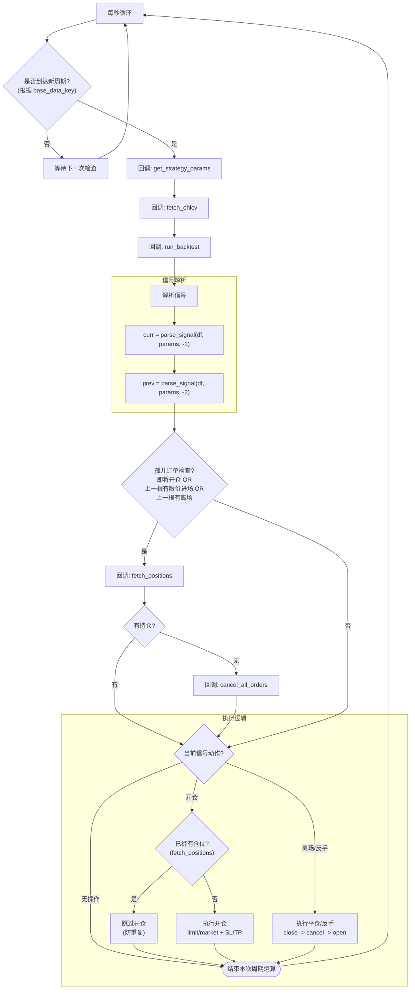

# 交易机器人：信号触发与订单执行规范

本文档描述交易机器人的设计理念、信号触发规则和订单执行逻辑。

---

> [!IMPORTANT]
> **硬约束（必须遵守）**：交易机器人支持多品种，但同一 `symbol` 仅允许一个策略；同品种多策略会直接报错并拒绝执行。

## 1. 设计原则

### 1.1 核心理念

**交易机器人只关心逻辑，不关心网络请求。**

所有需要网络请求的操作都通过**回调函数**委托给调用方。原因：
- 不同交易所 API 差异大
- 股票和加密货币情况不同
- 后端可能使用 ccxt、自有 SDK 或其他方式

### 1.2 无状态架构

> [!IMPORTANT]
> **信号即状态，交易所即真相**

| 原则 | 说明 |
|------|------|
| **无本地状态** | 不持久化任何状态文件，不需要快照恢复 |
| **信号即状态** | 从回测引擎输出直接推断当前应该做什么 |
| **交易所即真相** | 通过 `fetch_positions` 和 `fetch_open_orders` 获取实际状态 |
| **单策略单仓位** | 一个策略对应一个 symbol，与回测引擎完全对齐 |

### 1.3 设计约定

1. **全面使用 Pydantic**：所有数据模型、回调函数的输入输出都使用 Pydantic 类型定义
2. **回调函数接口**：所有网络请求通过回调函数
4. **时间统一 UTC**：所有时间使用 UTC 格式（北京时间 08:15 和 UTC 00:15 是同一瞬间，为统一标准全部使用 UTC）
5. **日志系统**：使用 **loguru** 打印日志
   - **不保存本地**，由 Docker 控制日志收集
   - **INFO 级别**用于关键操作（进场、离场、挂单）
   - 可通过参数控制日志级别（DEBUG/INFO/WARNING/ERROR）
6. **配置参数**：

| 参数名 | 类型 | 默认值 | 说明 |
|--------|------|--------|------|
| `loop_interval_sec` | `float` | `1.0` | 检查循环间隔（秒） |
| `log_level` | `str` | `"INFO"` | loguru 日志级别 |
| `entry_order_type` | `str` | `"limit"` | 进场订单类型 (`limit`/`market`) |
| `settlement_currency` | `str` | `"USDT"` | 结算币种 (如 USDT, BTC, USDC) |

| `enable_aggregation` | `bool` | `False` | 启用多策略聚合（当前版本不支持，预留字段） |

### 1.4 多品种架构与限制

交易机器人支持同时运行多个品种（Symbols），但遵循以下严格限制：

1. **单品种单策略 (One Strategy Per Symbol)**：
   - 每个品种只能绑定一个独立策略。
   - **不支持策略聚合**：即不支持在同一个品种上同时运行多个策略（如“趋势策略+均值回归策略”同时操作 BTC/USDT）。
   - **硬约束**：`get_strategy_params` 若返回同一 symbol 的多个策略条目，机器人会直接报错并拒绝执行（Fail-Fast）。

2. **单品种单仓位 (One Position Per Symbol)**：
   - 每个品种在交易所只维护一个独立的仓位。
   - **不支持仓位聚合**：即不支持多个策略共享同一个品种的仓位。Bot 假设特定 Symbol 的所有持仓都归属于当前绑定的唯一策略。

3. **独立运行模型**：
   - Bot 被视为一组独立的 `(Symbol, Strategy)` 对的集合。
   - 这里的“多品种支持”是指 Bot 可以同时管理 Symbol A、Symbol B、Symbol C，但它们之间是**完全隔离**的，互不干扰，逻辑上等同于运行了多个单品种 Bot。

---

## 2. 回调函数接口

交易机器人通过回调函数与外部交互，实现逻辑与 I/O 的完全解耦。

> [!TIP]
> **详细规范请参考独立文档**：
> 👉 [02_callbacks_spec.md](./02_callbacks_spec.md)
>
> 该文档包含：
> - 完整的回调函数分类与类型签名
> - 统一的错误处理机制 (Fail-Fast)
> - 信号解析与 `SignalState` 数据结构定义
> - 策略参数验证规则

---

---

## 3. 运行机制

### 3.1 周期检查逻辑

交易机器人**每秒检查一次**，但**每个周期只执行一次核心运算**。

流程：
1. 每秒检查是否到达新的周期起点（如 15m 周期的整 15 分钟）
2. 只有到达新周期才进入核心运算
3. 记录上次核心运算时间（UTC），避免同一周期内重复执行
4. 每秒的检查永不停歇

**周期基准**：使用回测引擎 `DataSourceConfig` 的 `base_data_key` 字段（由来 `get_strategy_params` 回调返回）。
- **解析逻辑**：提取 `_` 后的最后一部分作为周期（例如 `ohlcv_15m` -> `15m`, `trade_1h` -> `1h`），支持更灵活的命名格式。

### 3.2 每周期执行流程

#### 3.2.1 API 调用优化（可选）

为减少冗余请求（如重复的 `fetch_positions` 和 `cancel_all_orders`），Bot 可实现缓存与去重机制。

> [!NOTE]
> 这是一个**可选**功能，初版可暂不实现。
> 初版实现可能会产生冗余的 `cancel_all_orders` 调用（例如在孤儿检查和信号执行中重复调用），这虽然浪费少量 API 权重，但**逻辑上是安全的**。
> 详细设计请参考独立文档：[05_api_optimization_spec.md](./05_api_optimization_spec.md)

### 3.3 用户职责与限制

| 场景 | 说明 |
|------|------|
| **Docker 重启** | 短时间重启可自动恢复；长时间搁置重启**需手动对齐仓位** |
| **策略更新** | **更新策略前必须手动清仓**，否则会导致状态不一致，Bot 不负责处理 |
| **职责边界** | Bot 仅负责根据信号执行交易，**SL/TP 由交易所触发**，异常状态恢复由用户负责 |

## 4. 交易所兼容性假设

- 支持**多头或空头**持仓（单向持仓模式）
- 支持加仓减仓
- 支持挂止盈止损条件单（交易所自动触发）
- **不支持括号订单**（仓位和 SL/TP 一起取消的那种）

---

---

## 5. 部署方式

由于一切都是回调函数，支持两种部署方式：

### 5.1 方式一：混合部署（安装到后端）

将 `pyo3-quant` 安装到后端项目，回调函数直接调用本地回测引擎和交易所 API。

### 5.2 方式二：独立部署（推荐）

本项目独立部署，回调函数通过 HTTP 调用后端 API 中转请求交易所。

### 5.3 对比分析

| 对比项 | 混合部署 | 独立部署 |
|--------|----------|----------|
| **本地调试** | 麻烦（需 build wheel 再安装） | **简单**（改完直接运行） |
| **开发迭代** | 慢（每次改代码都要重新打包） | **快**（增量更新，无缝衔接） |
| **云端部署** | 差不多 | 差不多 |
| **Docker** | 一个 | 两个（用 docker-compose） |

### 5.4 推荐方案

> [!TIP]
> **推荐独立部署**：牺牲一点部署复杂度（多一个 Docker），换来开发调试的极大便利。
>
> - 本地：完全增量更新，回测引擎开发和机器人调试无缝衔接
> - 服务器：下载 Git Action 编译的二进制即可，纯 Python 部分直接运行

---

## 6. 更新日志 (Changelog)

### v1.1.0 (2026-01-20)
- **Feature**: 支持自定义结算币种 (`settlement_currency`)，不再强制绑定 USDT。
- **Optimization**: 优化周期解析逻辑，不再依赖 `ohlcv_` 前缀，增强兼容性。
