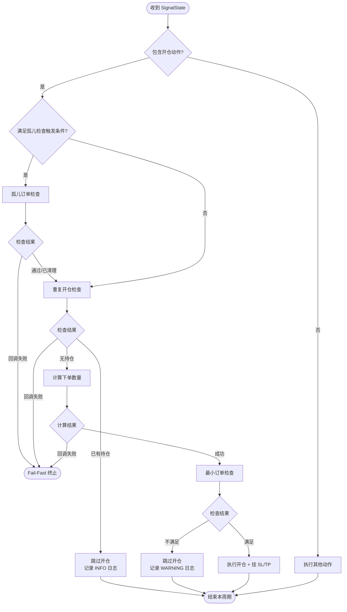

# 运行时检查与动态计算规范

本文档描述交易机器人在执行信号动作前的**运行时检查**和**动态计算**逻辑。

> [!NOTE]
> 本文档是 [01_bot_design_spec.md](./01_bot_design_spec.md) 的补充文档。
>
> **职责边界**：
> - **解析器**：纯计算、无状态，只根据 DataFrame 输出**交易意图**（参见 [03_parser_spec.md](./03_parser_spec.md)）
> - **交易机器人**：负责**运行时检查**和**动态计算**（本文档内容）

---

## 1. 概述

交易机器人在收到解析器返回的 `SignalState.actions` 后，**不会直接执行**，而是先进行一系列运行时检查和动态计算。

### 1.1 检查与计算流程

以**开仓信号**为例，完整流程如下：

```
parse_signal() 返回 actions
       ↓
┌─────────────────────────────────────┐
│        运行时检查（顺序执行）          │
├─────────────────────────────────────┤
│ 1. 孤儿订单检查（条件触发）            │
│ 2. 重复开仓检查                       │
│ 3. 下单数量计算                       │
│ 4. 最小订单检查                       │
└─────────────────────────────────────┘
       ↓ 全部通过
    执行订单动作
```

> [!IMPORTANT]
> **检查失败处理**：
> - **孤儿订单检查**：执行清理动作（`cancel_all_orders`），然后继续
> - **重复开仓检查**：跳过开仓动作，记录 INFO 日志，继续执行其他动作（如有）
> - **最小订单检查**：跳过开仓动作，记录 WARNING 日志，继续执行其他动作（如有）
>
> 这些检查失败**不触发 Fail-Fast**，因为它们是预期内的业务场景，不是系统错误。

---

## 2. 孤儿订单检查

### 2.1 定义

**孤儿订单（Orphan Orders）**：指在交易所挂着但不再需要的订单，通常发生在以下场景：

| 场景 | 说明 |
|------|------|
| **限价单未成交** | 上一周期挂的限价进场单未成交，新周期信号已变化 |
| **SL 触发后残留 TP** | 止损条件单触发后，止盈条件单仍挂着（交易所不自动联动取消） |
| **TP 触发后残留 SL** | 止盈条件单触发后，止损条件单仍挂着 |
| **离场后残留条件单** | Next-Bar 离场后，之前挂的 SL/TP 条件单可能仍存在 |

### 2.2 触发条件

孤儿订单检查在以下条件**任意满足**时触发：

| 条件 | 判断方式 | 说明 |
|------|----------|------|
| **当前信号即将开仓** | `curr.actions` 包含 `create_limit/market_order` | 开仓前确保没有残留挂单 |
| **上一根有限价进场** | `prev.actions` 包含 `create_limit_order` | 限价单可能未成交需清理 |
| **上一根有任意离场** | `prev.has_exit == True` | 包括 Next-Bar 和 In-Bar 离场 |

其中：
- `curr = parse_signal(df, params, -1)`（当前 K 线）
- `prev = parse_signal(df, params, -2)`（上一根 K 线）

### 2.3 检查逻辑

**逻辑描述**：

1. **查询持仓**：调用 `fetch_positions` 获取当前品种的持仓信息。
2. **执行清理**：
   - 如果**无持仓**：说明之前的挂单可能已变成孤儿，调用 `cancel_all_orders` 清理所有挂单。
   - 如果**有持仓**：说明挂单是正常的止盈止损单，**不进行清理**。
3. **错误处理**：任意一步回调失败，则触发 Fail-Fast。

> [!NOTE]
> **为什么无持仓才清理**：
> 如果有持仓，说明上一周期的订单已成交，当前挂单（SL/TP）是正常的保护单，不应清理。
> 如果无持仓，说明要么订单未成交，要么已离场，残留的挂单都是孤儿。

---

## 3. 重复开仓检查

### 3.1 定义

**重复开仓（Duplicate Entry）**：指在已有持仓的情况下，信号又要求开仓。

在**单品种单仓位**的设计下，这种情况意味着：
- 上一周期的开仓信号已经成交
- 当前周期的信号（可能由于延迟或其他原因）仍然是"开仓"

### 3.2 触发条件

当 `curr.actions` 包含 `create_limit_order` 或 `create_market_order` 时触发。

### 3.3 检查逻辑

**逻辑描述**：

1. **查询持仓**：调用 `fetch_positions` 获取当前品种的持仓信息。
2. **判断状态**：
   - 如果**无持仓**：允许开仓（Proceed）。
   - 如果**有持仓**：
     - 若持仓方向与信号方向**一致**：判断为重复开仓，**跳过**（Skip）本次开仓动作。
     - 若持仓方向与信号方向**不一致**：说明可能存在未处理的反向持仓（正常反手流程中，前置的平仓动作应已执行完毕，此时应无持仓），为安全起见，记录警告并**跳过**开仓。
3. **错误处理**：获取持仓失败则触发 Fail-Fast。

### 3.4 与孤儿检查的关系

如果同时满足孤儿检查和重复开仓检查的触发条件（例如"当前信号即将开仓"），执行顺序是：

1. **先执行孤儿检查**：清理可能存在的残留挂单
2. **再执行重复开仓检查**：确认是否已有持仓

> [!TIP]
> 在 [05_api_optimization_spec.md](./05_api_optimization_spec.md) 中描述的 `SymbolContext` 缓存机制下，这两个检查可以共享 `fetch_positions` 的结果，避免重复 API 调用。

---

## 4. 下单数量计算

### 4.1 概述

解析器返回的 `SignalAction` **不包含 `amount` 字段**，因为数量需要根据实时余额动态计算。

Bot 在执行开仓动作前，必须计算下单数量。

### 4.2 计算公式

**逻辑描述**：

1. **获取账户余额**：调用 `fetch_balance` 获取可用资金（根据 `params.settlement_currency`，默认 USDT）。
2. **获取市场信息**：调用 `fetch_market_info` 获取 `precision_amount`（数量精度）。
   - **Fail-Fast**：如果回调失败或返回数据为空，直接报错终止。
3. **计算名义仓位价值**：
   $$
   \text{Position Value} = \text{Available Balance} \times \text{Position Size \%} \times \text{Leverage}
   $$
4. **计算下单数量**：
   $$
   \text{Raw Amount} = \frac{\text{Position Value}}{\text{Entry Price}}
   $$
5. **精度截断**：
   - **Step Size 模式 (Float)**：`Amount = floor(Raw / StepSize) * StepSize`

### 4.3 精度处理规则 (`precision_amount`)

| 类型 | 说明 | 处理逻辑 |
|------|------|----------|
| **Step Size (Float)** | 如 `0.001`, `1.0`, `5.0` | 唯一支持的模式。计算时按步长向下取整。 |

> [!IMPORTANT]
> 本系统仅支持 Step Size 模式。如果交易所返回的是小数位数（如 `3`），将被视为步长 `3.0`。请务必让后端进行转换。

### 4.4 相关策略参数

| 参数名 | 类型 | 说明 |
|--------|------|------|
| `position_size_pct` | `float` | 仓位比例（0.0 ~ 1.0），默认 1.0 表示全仓 |
| `leverage` | `int` | 杠杆倍数，默认 1 |

> [!NOTE]
> 这些参数在 `StrategyParams` 中定义，由用户在策略参数回调中设置。

---

## 5. 最小订单检查

### 5.1 定义

交易所对每笔订单有**最小数量**限制。如果计算出的下单数量低于限制，订单会被交易所拒绝。

### 5.2 触发条件

在**下单数量计算完成后**、**实际下单前**触发。

### 5.3 检查逻辑

**逻辑描述**：

1. **确定最小数量限制 (`Limit_Amount`)**：
   - 从 `fetch_market_info` 获取 `min_amount`。
   - 如果 `min_amount` 为 0 或不存在，则直接使用 `precision_amount`（步长）作为限制（例如 `precision_amount` 为 `0.001`，则最小限制为 `0.001`）。
3. **检查限制**：
   - **最小数量检查**：检查 $\text{Amount} \ge \text{Limit\_Amount}$
4. **结果判定**：
   - 若不满足，则视为**检查失败**。

### 5.4 检查失败处理

| 行为 | 说明 |
|------|------|
| **记录 WARNING 日志** | 说明本金不足以满足最小订单要求 |
| **跳过本次开仓** | 不执行 `create_limit/market_order`，也不挂 SL/TP |
| **继续执行其他动作** | 如果信号中还有其他非开仓动作（如 `close_position`），继续执行 |
| **不触发 Fail-Fast** | 这是预期内的业务场景，不是系统错误 |

> [!NOTE]
> **与 Fail-Fast 的区别**：
> - **Fail-Fast**：回调函数返回 `success=False`，表示系统级错误（如网络超时），终止本轮循环。
> - **最小订单检查失败**：业务逻辑判断（本金不足），跳过特定动作但不终止。

---

## 6. 完整执行流程（开仓场景）

以下是 Bot 处理一个包含开仓信号的完整流程：



---

## 7. 日志级别约定

| 场景 | 日志级别 | 示例消息 |
|------|----------|----------|
| 孤儿订单检查：已清理 | `INFO` | `[BTC/USDT] 孤儿订单检查：无持仓，已清理所有挂单` |
| 重复开仓检查：跳过 | `INFO` | `[BTC/USDT] 重复开仓检查：已有 long 持仓，跳过开仓` |
| 最小订单检查：失败 | `WARNING` | `[BTC/USDT] 最小订单检查失败：数量 0.001 < 最小数量 0.01` |
| 回调函数失败 | `ERROR` | `[BTC/USDT] fetch_positions 失败：NetworkError` |
